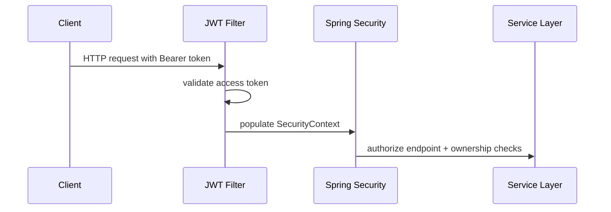
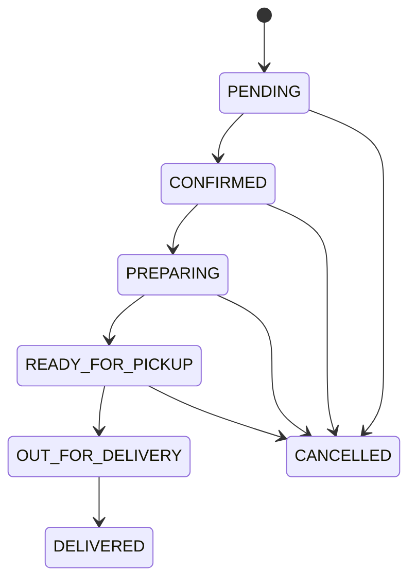
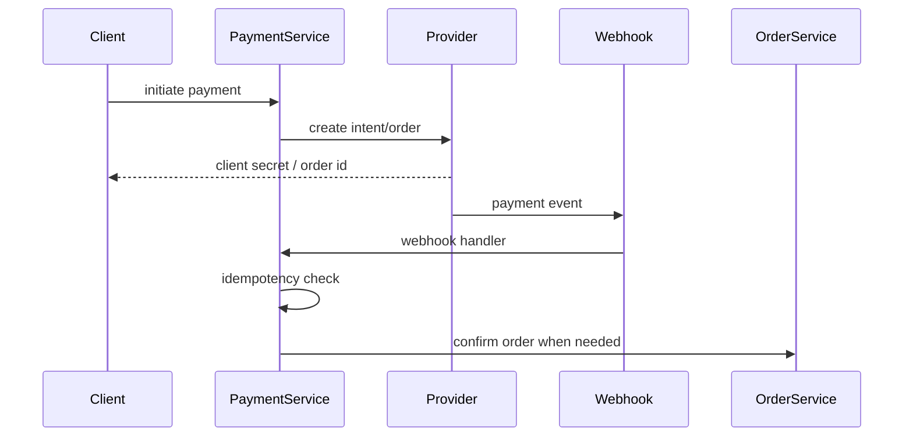
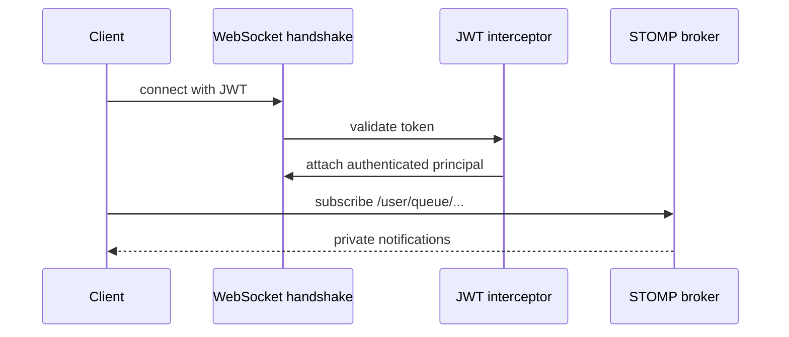

# FoodDash Backend Architecture

## 1. Project Overview

FoodDash is a Spring Boot backend for a multi-role food delivery platform.

Primary roles:

1. `CUSTOMER`
2. `RESTAURANT_OWNER`
3. `DELIVERY_PERSON`
4. `ADMIN`

Core domains:

1. Authentication and JWT authorization
2. Restaurant and menu management
3. Order lifecycle
4. Payment initiation and webhook processing
5. Delivery tracking and websocket notifications
6. Notification persistence and delivery
7. Audit logging and request correlation

## 2. Package Structure

```text
com.fooddash
  config        - security, websocket, cache, request filters
  controller    - REST API endpoints
  dto           - request/response contracts
  exception     - global exception handling
  filter        - servlet filters for correlation and logging
  model         - JPA entities and enums
  repository    - Spring Data repositories
  service       - business logic
  util          - JWT, mapping, and small helpers
```

## 3. Security Flow



Security layers:

1. HTTP endpoint access is controlled by Spring Security.
2. Role checks are supplemented with ownership checks in `OwnershipAuthorizationService`.
3. Websocket handshakes are JWT-authenticated before a principal is attached.
4. User destinations use `/user/queue/**` for private events.

## 4. JWT Lifecycle

1. `AuthService.register()` creates a user with a hashed password.
2. `AuthService.login()` authenticates credentials and issues:
   1. access token
   2. refresh token
3. Refresh tokens are persisted in `refresh_tokens`.
4. Logout blacklists the access token and clears refresh tokens.
5. JWT claims include:
   1. `uid`
   2. `role`
   3. `tokenType`

## 5. Redis Usage

Redis is used for:

1. Cache storage for restaurants and menu items
2. Token/session style ephemeral data where applicable

Cache behavior:

1. Public restaurant listing is cached by query parameters.
2. Menu listings are cached by restaurant/category/availability.
3. Mutations evict the relevant cache regions.

## 6. Order Lifecycle

Allowed state path:



Rules:

1. Invalid transitions throw `IllegalStateException`.
2. Role permissions are enforced before transition validation.
3. Customers can only cancel before delivery starts.
4. Delivery personnel can only advance assigned deliveries.
5. No order status is mutated directly outside `OrderStateMachineService`.

## 7. Payment Flow



Important behaviors:

1. Provider webhooks are deduplicated through `webhook_events`.
2. Payment records retain provider references and webhook metadata.
3. Payment success can confirm the underlying order if it is still pending.
4. Payment completion and order confirmation trigger notifications and audit logs.

## 8. Websocket Flow



Implementation notes:

1. `/ws` is the websocket endpoint.
2. The handshake interceptor validates the JWT.
3. The handshake handler maps the authenticated user to the websocket principal.
4. Private messages are sent with `convertAndSendToUser(email, "/queue/notifications", payload)`.

## 9. Notification Flow

Notification events are persisted in `notifications` and pushed over websocket.

Trigger points:

1. Order placed
2. Payment completed
3. Order confirmed
4. Out for delivery
5. Delivered

Typical recipients:

1. Restaurant owner for order placement
2. Customer for payment/order status changes
3. Delivery person for delivery progress where applicable

## 10. Audit Logging

Audit logs are written for:

1. Order updates
2. Payment webhook events
3. Restaurant and menu updates
4. Admin user actions

Stored fields:

1. Actor user id
2. Action
3. Entity type
4. Entity id
5. Payload
6. Timestamp

## 11. Testing Strategy

Test layers:

1. Unit tests with JUnit 5 and Mockito for service logic
2. Repository and integration tests against PostgreSQL and Redis containers when Docker is available
3. Existing HTTP flow tests exercise auth, restaurant, menu, and user management endpoints

Testcontainers:

1. PostgreSQL container provides the schema runtime used by Flyway.
2. Redis container backs the cache configuration.
3. Tests clean the database before each case to avoid cross-test contamination.

## 12. Deployment Setup

Local container stack:

1. `Dockerfile` builds the application jar and runs it on Java 21.
2. `docker-compose.yml` starts:
   1. `app`
   2. `postgres`
   3. `redis`

Required runtime environment:

1. `SPRING_PROFILES_ACTIVE=prod`
2. `DB_URL`
3. `DB_USERNAME`
4. `DB_PASSWORD`
5. `REDIS_HOST`
6. `REDIS_PORT`
7. `JWT_SECRET`
8. Provider secrets for Stripe and Razorpay when enabled

## 13. Ownership Authorization Rules

1. Restaurant owners can manage only their own restaurants and menu items.
2. Restaurant owners can manage only orders for their own restaurants.
3. Customers can access only their own orders.
4. Delivery persons can access only their assigned deliveries.
5. Admins bypass ownership checks but still pass through state machine validation.

## 14. State Machine Design

The order state machine is centralized in `OrderStateMachineService`.

Why this exists:

1. Prevents ad hoc status updates scattered across services.
2. Ensures valid status progression.
3. Separates role permissions from lifecycle rules.
4. Makes invalid transitions deterministic and testable.

## 15. Adding New Features

Recommended extension flow:

1. Add or extend a DTO.
2. Add repository methods if persistence access is needed.
3. Add business logic in the service layer.
4. Enforce ownership through `OwnershipAuthorizationService`.
5. Enforce lifecycle constraints through `OrderStateMachineService` where relevant.
6. Record audit events for state-changing operations.
7. Add notification hooks if the user should receive a websocket event.
8. Add unit tests first, then integration coverage when the flow crosses boundaries.
